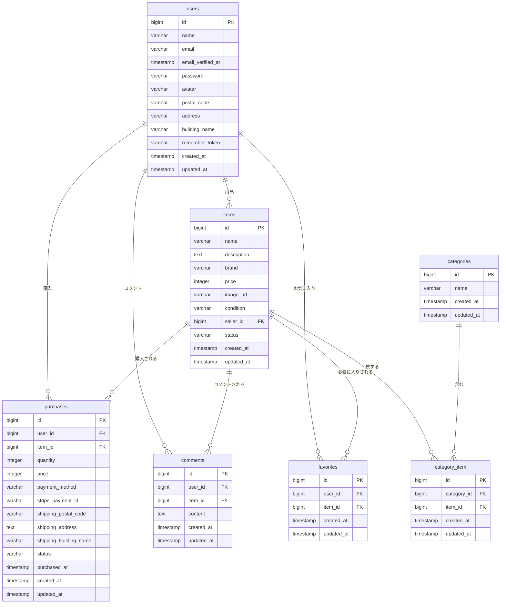

<h1>フリマアプリ</h1>

<h2>📋 再提出対応内容</h2>

<h3>🔧 主要な修正・改善点</h3>

<h4>1. Stripe決済機能の完全実装</h4>
<ul>
<li><strong>カード決済</strong>: Stripe Checkoutの決済画面に正しく遷移するよう修正</li>
<li><strong>コンビニ決済</strong>: PaymentIntentを使用したコンビニ決済を実装</li>
<li><strong>要件対応</strong>: FN023「Stripeの決済画面に接続される」を完全実装</li>
<li>決済完了後のデータベース登録と商品ステータス更新を実装</li>
</ul>

<h4>2. バリデーション・エラーメッセージの統一</h4>
<ul>
<li>会員登録・ログイン時のエラーメッセージを要件通りに修正</li>
<li>住所入力フォームのバリデーション形式を統一（郵便番号形式等）</li>
<li>メールアドレス重複チェックを追加</li>
<li>商品出品時のバリデーションメッセージキーを修正</li>
</ul>

<h4>3. ユーザーフロー改善</h4>
<ul>
<li>会員登録後のプロフィール設定画面遷移を実装（FN006対応）</li>
<li>ログアウト時のセッション無効化処理を強化</li>
<li>購入完了後の適切な画面遷移とメッセージ表示</li>
</ul>

<h4>4. データベース設計の改善</h4>
<ul>
<li><code>purchases</code>テーブルに<code>stripe_payment_id</code>カラムを追加</li>
<li>商品状態の型統一（数値定数に統一）</li>
<li>Purchase.phpモデルのfillable属性とキャスト設定を修正</li>
</ul>

<h4>5. テストコードの改善</h4>
<ul>
<li>Stripe決済に対応したテストケースに修正</li>
<li>実際のAPI通信を避けるモック処理を実装</li>
<li>全79テストケースが正常に通過することを確認</li>
</ul>

<h2>🗄️ データベース設計</h2>

### ER図

<h3>テーブル一覧</h3>

<h4>users テーブル</h4>
<table border="1">
<tr><th>カラム名</th><th>型</th><th>説明</th></tr>
<tr><td>id</td><td>bigint</td><td>ユーザーID（主キー）</td></tr>
<tr><td>name</td><td>varchar(255)</td><td>ユーザー名</td></tr>
<tr><td>email</td><td>varchar(255)</td><td>メールアドレス（ユニーク）</td></tr>
<tr><td>email_verified_at</td><td>timestamp</td><td>メール認証日時</td></tr>
<tr><td>password</td><td>varchar(255)</td><td>パスワード（ハッシュ化）</td></tr>
<tr><td>avatar</td><td>varchar(255)</td><td>プロフィール画像パス</td></tr>
<tr><td>postal_code</td><td>varchar(255)</td><td>郵便番号</td></tr>
<tr><td>address</td><td>varchar(255)</td><td>住所</td></tr>
<tr><td>building_name</td><td>varchar(255)</td><td>建物名</td></tr>
<tr><td>remember_token</td><td>varchar(100)</td><td>ログイン保持トークン</td></tr>
<tr><td>created_at</td><td>timestamp</td><td>作成日時</td></tr>
<tr><td>updated_at</td><td>timestamp</td><td>更新日時</td></tr>
</table>

<h4>items テーブル</h4>
<table border="1">
<tr><th>カラム名</th><th>型</th><th>説明</th></tr>
<tr><td>id</td><td>bigint</td><td>商品ID（主キー）</td></tr>
<tr><td>name</td><td>varchar(255)</td><td>商品名</td></tr>
<tr><td>description</td><td>text</td><td>商品説明</td></tr>
<tr><td>brand</td><td>varchar(255)</td><td>ブランド名</td></tr>
<tr><td>price</td><td>integer</td><td>価格</td></tr>
<tr><td>image_url</td><td>varchar(255)</td><td>商品画像URL</td></tr>
<tr><td>condition</td><td>varchar(255)</td><td>商品状態</td></tr>
<tr><td>seller_id</td><td>bigint</td><td>出品者ID（外部キー）</td></tr>
<tr><td>status</td><td>varchar(255)</td><td>商品状態（available/sold）</td></tr>
<tr><td>created_at</td><td>timestamp</td><td>作成日時</td></tr>
<tr><td>updated_at</td><td>timestamp</td><td>更新日時</td></tr>
</table>

<h4>purchases テーブル</h4>
<table border="1">
<tr><th>カラム名</th><th>型</th><th>説明</th></tr>
<tr><td>id</td><td>bigint</td><td>購入ID（主キー）</td></tr>
<tr><td>user_id</td><td>bigint</td><td>購入者ID（外部キー）</td></tr>
<tr><td>item_id</td><td>bigint</td><td>商品ID（外部キー）</td></tr>
<tr><td>quantity</td><td>integer</td><td>購入数量</td></tr>
<tr><td>price</td><td>integer</td><td>購入価格</td></tr>
<tr><td>payment_method</td><td>varchar(255)</td><td>支払い方法</td></tr>
<tr><td>stripe_payment_id</td><td>varchar(255)</td><td>Stripe決済ID</td></tr>
<tr><td>shipping_postal_code</td><td>varchar(255)</td><td>配送先郵便番号</td></tr>
<tr><td>shipping_address</td><td>text</td><td>配送先住所</td></tr>
<tr><td>shipping_building_name</td><td>varchar(255)</td><td>配送先建物名</td></tr>
<tr><td>status</td><td>varchar(255)</td><td>購入ステータス</td></tr>
<tr><td>purchased_at</td><td>timestamp</td><td>購入日時</td></tr>
<tr><td>created_at</td><td>timestamp</td><td>作成日時</td></tr>
<tr><td>updated_at</td><td>timestamp</td><td>更新日時</td></tr>
</table>

<h4>categories テーブル</h4>
<table border="1">
<tr><th>カラム名</th><th>型</th><th>説明</th></tr>
<tr><td>id</td><td>bigint</td><td>カテゴリID（主キー）</td></tr>
<tr><td>name</td><td>varchar(255)</td><td>カテゴリ名</td></tr>
<tr><td>created_at</td><td>timestamp</td><td>作成日時</td></tr>
<tr><td>updated_at</td><td>timestamp</td><td>更新日時</td></tr>
</table>

<h4>category_item テーブル（中間テーブル）</h4>
<table border="1">
<tr><th>カラム名</th><th>型</th><th>説明</th></tr>
<tr><td>id</td><td>bigint</td><td>ID（主キー）</td></tr>
<tr><td>category_id</td><td>bigint</td><td>カテゴリID（外部キー）</td></tr>
<tr><td>item_id</td><td>bigint</td><td>商品ID（外部キー）</td></tr>
<tr><td>created_at</td><td>timestamp</td><td>作成日時</td></tr>
<tr><td>updated_at</td><td>timestamp</td><td>更新日時</td></tr>
</table>

<h4>favorites テーブル</h4>
<table border="1">
<tr><th>カラム名</th><th>型</th><th>説明</th></tr>
<tr><td>id</td><td>bigint</td><td>ID（主キー）</td></tr>
<tr><td>user_id</td><td>bigint</td><td>ユーザーID（外部キー）</td></tr>
<tr><td>item_id</td><td>bigint</td><td>商品ID（外部キー）</td></tr>
<tr><td>created_at</td><td>timestamp</td><td>作成日時</td></tr>
<tr><td>updated_at</td><td>timestamp</td><td>更新日時</td></tr>
</table>

<h4>comments テーブル</h4>
<table border="1">
<tr><th>カラム名</th><th>型</th><th>説明</th></tr>
<tr><td>id</td><td>bigint</td><td>コメントID（主キー）</td></tr>
<tr><td>user_id</td><td>bigint</td><td>ユーザーID（外部キー）</td></tr>
<tr><td>item_id</td><td>bigint</td><td>商品ID（外部キー）</td></tr>
<tr><td>content</td><td>text</td><td>コメント内容</td></tr>
<tr><td>created_at</td><td>timestamp</td><td>作成日時</td></tr>
<tr><td>updated_at</td><td>timestamp</td><td>更新日時</td></tr>
</table>

<h2>環境構築</h2>
Dockerビルド 
1 git clone リンク 
2 docker-compose up -d --build 
MySQLは、OSによって起動しない場合があるのでそれぞれのPCに合わせてdocker-compose.ymlファイルを編集してください。 

<h2>Laravel開発環境</h2>
　
1 docker-compose exec php bash 
2 composer install 
3 .env.exampleファイルから.envを作成し、環境変数を変更 
4 php artisan key:generate 
5 php artisan migrate 
6 php artisan db:seed 

<h3>🔑 Stripe設定（重要）</h3>
.envファイルに以下のStripe設定を追加してください：
<pre>
# Stripe設定
STRIPE_PUBLIC_KEY="pk_test_xxxxxx"
STRIPE_SECRET_KEY="sk_test_xxxxxx"
</pre>

<h2>🧪 テスト実行</h2>
<pre>
# 全テスト実行
docker-compose exec php php artisan test

# 特定のテスト実行
docker-compose exec php php artisan test tests/Feature/PurchaseTest.php
</pre>

<h2>使用技術</h2>
PHP 8.4.4 
Laravel 8.83.8 
MySQL 8.02.6 
<strong>Stripe API</strong> (決済処理) 

<h2>🌟 主要機能</h2>
<ul>
<li>ユーザー認証（会員登録・ログイン・ログアウト）</li>
<li>商品一覧・詳細表示</li>
<li>商品検索機能</li>
<li>商品出品機能</li>
<li>お気に入り機能</li>
<li>コメント機能</li>
<li><strong>Stripe決済機能（カード・コンビニ）</strong></li>
<li>プロフィール管理</li>
<li>購入履歴管理</li>
</ul>

<h2>URL</h2>
開発環境: http://localhost/ 
phpMyAdmin: http://localhost:8080/

<h2>📝 備考</h2>
<ul>
<li>本アプリケーションはテスト環境用です</li>
<li>Stripe決済はテストモードで動作します</li>
<li>実際の決済は発生しません</li>
<li>全79テストケースが正常に通過することを確認済み</li>
</ul>
