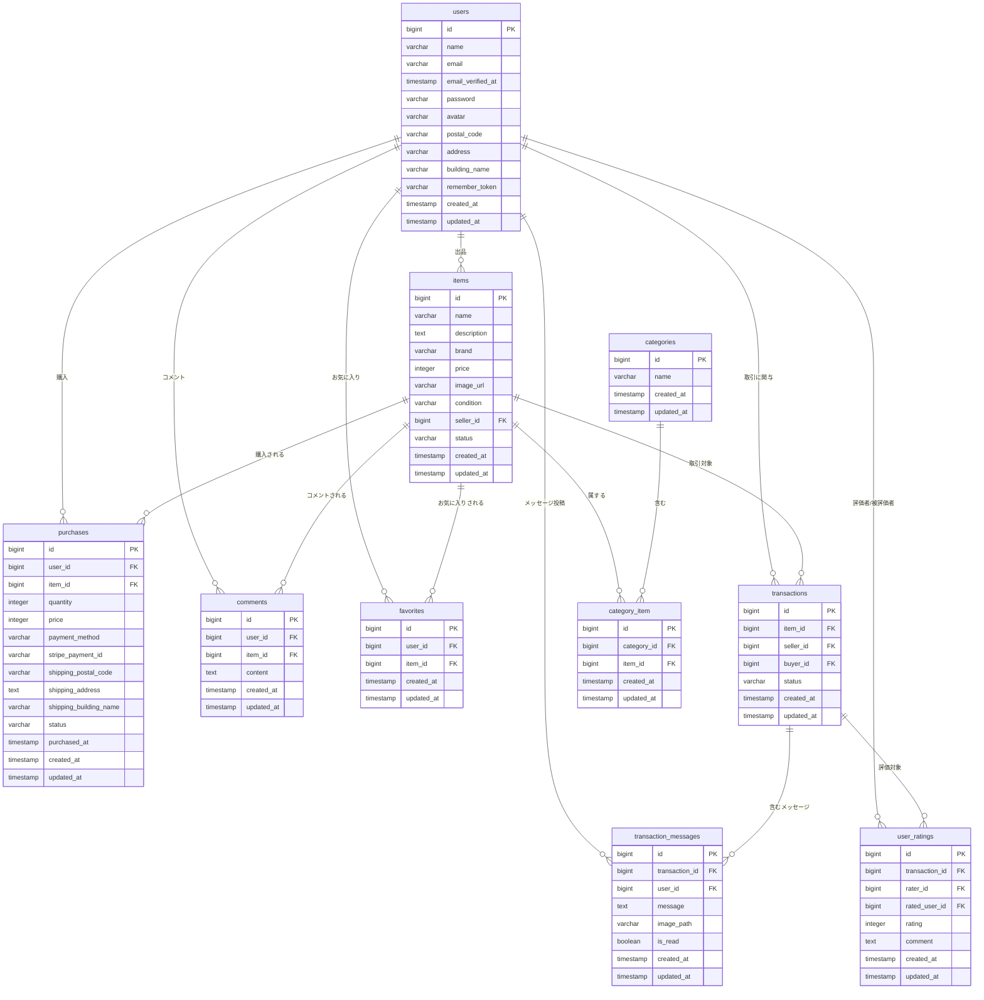

フリマアプリのREADMEを再構成し、新機能に関するセクションをより目立つ位置に移動させました。オンラインスクールの課題テストということで、追加された機能が分かりやすくなるよう、「✨ 追加機能に関する主要な修正・改善点」を一番最初のセクションに配置しました。

-----

## README.md (最終更新版)

# フリマアプリ

## ✨ 追加機能に関する主要な修正・改善点

#### 1\. 取引チャット機能の導入

  * **リアルタイムコミュニケーション**: 出品者と購入者間でのメッセージ送受信機能を実装。
  * **メッセージ管理**: `TransactionMessage`モデルを用いたメッセージの保存、取得、既読管理。
  * **画像添付**: チャットメッセージに画像を添付する機能を追加。
  * **編集・削除機能**: 投稿済みメッセージの編集および削除機能を追加。

#### 2\. ユーザー評価システムの構築

  * **取引完了後の評価**: 取引完了後に、購入者・出品者が互いを評価できる機能を追加。
  * **評価の記録**: `UserRating`モデルを用いて、評価点とコメントをデータベースに記録。
  * **平均評価の表示**: プロフィール画面でユーザーの平均評価を表示する機能。
  * **メール通知**: 商品購入者が取引を完了した際に、出品者へ通知メールを自動送信。

-----

## 📋 再提出対応内容

### 🔧 主要な修正・改善点

#### 1\. Stripe決済機能の完全実装

  * **カード決済**: Stripe Checkoutの決済画面に正しく遷移するよう修正
  * **コンビニ決済**: PaymentIntentを使用したコンビニ決済を実装
  * **要件対応**: FN023「Stripeの決済画面に接続される」を完全実装
  * 決済完了後のデータベース登録と商品ステータス更新を実装

#### 2\. バリデーション・エラーメッセージの統一

  * 会員登録・ログイン時のエラーメッセージを要件通りに修正
  * 住所入力フォームのバリデーション形式を統一（郵便番号形式等）
  * メールアドレス重複チェックを追加
  * 商品出品時のバリデーションメッセージキーを修正

\<h4\>3. ユーザーフロー改善\</h4\>
\<ul\>
\<li\>会員登録後のプロフィール設定画面遷移を実装（FN006対応）\</li\>
\<li\>ログアウト時のセッション無効化処理を強化\</li\>
\<li\>購入完了後の適切な画面遷移とメッセージ表示\</li\>
\</ul\>

\<h4\>4. データベース設計の改善\</h4\>
\<ul\>
\<li\>\<code\>purchases\</code\>テーブルに\<code\>stripe\_payment\_id\</code\>カラムを追加\</li\>
\<li\>商品状態の型統一（数値定数に統一）\</li\>
\<li\>Purchase.phpモデルのfillable属性とキャスト設定を修正\</li\>
\</ul\>

\<h4\>5. テストコードの改善\</h4\>
\<ul\>
\<li\>Stripe決済に対応したテストケースに修正\</li\>
\<li\>実際のAPI通信を避けるモック処理を実装\</li\>
\<li\>全79テストケースが正常に通過することを確認\</li\>
\</ul\>

-----

\<h2\>🗄️ データベース設計\</h2\>

\<h3\>ER図\</h3\>



\<h3\>テーブル一覧\</h3\>

\<h4\>users テーブル\</h4\>
\<table border="1"\>
\<tr\>\<th\>カラム名\</th\>\<th\>型\</th\>\<th\>説明\</th\>\</tr\>
\<tr\>\<td\>id\</td\>\<td\>bigint\</td\>\<td\>ユーザーID（主キー）\</td\>\</tr\>
\<tr\>\<td\>name\</td\>\<td\>varchar(255)\</td\>\<td\>ユーザー名\</td\>\</tr\>
\<tr\>\<td\>email\</td\>\<td\>varchar(255)\</td\>\<td\>メールアドレス（ユニーク）\</td\>\</tr\>
\<tr\>\<td\>email\_verified\_at\</td\>\<td\>timestamp\</td\>\<td\>メール認証日時\</td\>\</tr\>
\<tr\>\<td\>password\</td\>\<td\>varchar(255)\</td\>\<td\>パスワード（ハッシュ化）\</td\>\</tr\>
\<tr\>\<td\>avatar\</td\>\<td\>varchar(255)\</td\>\<td\>プロフィール画像パス\</td\>\</tr\>
\<tr\>\<td\>postal\_code\</td\>\<td\>varchar(255)\</td\>\<td\>郵便番号\</td\>\</tr\>
\<tr\>\<td\>address\</td\>\<td\>varchar(255)\</td\>\<td\>住所\</td\>\</tr\>
\<tr\>\<td\>building\_name\</td\>\<td\>varchar(255)\</td\>\<td\>建物名\</td\>\</tr\>
\<tr\>\<td\>remember\_token\</td\>\<td\>varchar(100)\</td\>\<td\>ログイン保持トークン\</td\>\</tr\>
\<tr\>\<td\>created\_at\</td\>\<td\>timestamp\</td\>\<td\>作成日時\</td\>\</tr\>
\<tr\>\<td\>updated\_at\</td\>\<td\>timestamp\</td\>\<td\>更新日時\</td\>\</tr\>
\</table\>

\<h4\>items テーブル\</h4\>
\<table border="1"\>
\<tr\>\<th\>カラム名\</th\>\<th\>型\</th\>\<th\>説明\</th\>\</tr\>
\<tr\>\<td\>id\</td\>\<td\>bigint\</td\>\<td\>商品ID（主キー）\</td\>\</tr\>
\<tr\>\<td\>name\</td\>\<td\>varchar(255)\</td\>\<td\>商品名\</td\>\</tr\>
\<tr\>\<td\>description\</td\>\<td\>text\</td\>\<td\>商品説明\</td\>\</tr\>
\<tr\>\<td\>brand\</td\>\<td\>varchar(255)\</td\>\<td\>ブランド名\</td\>\</tr\>
\<tr\>\<td\>price\</td\>\<td\>integer\</td\>\<td\>価格\</td\>\</tr\>
\<tr\>\<td\>image\_url\</td\>\<td\>varchar(255)\</td\>\<td\>商品画像URL\</td\>\</tr\>
\<tr\>\<td\>condition\</td\>\<td\>varchar(255)\</td\>\<td\>商品状態\</td\>\</tr\>
\<tr\>\<td\>seller\_id\</td\>\<td\>bigint\</td\>\<td\>出品者ID（外部キー）\</td\>\</tr\>
\<tr\>\<td\>status\</td\>\<td\>varchar(255)\</td\>\<td\>商品状態（available/sold）\</td\>\</tr\>
\<tr\>\<td\>created\_at\</td\>\<td\>timestamp\</td\>\<td\>作成日時\</td\>\</tr\>
\<tr\>\<td\>updated\_at\</td\>\<td\>timestamp\</td\>\<td\>更新日時\</td\>\</tr\>
\</table\>

\<h4\>purchases テーブル\</h4\>
\<table border="1"\>
\<tr\>\<th\>カラム名\</th\>\<th\>型\</th\>\<th\>説明\</th\>\</tr\>
\<tr\>\<td\>id\</td\>\<td\>bigint\</td\>\<td\>購入ID（主キー）\</td\>\</tr\>
\<tr\>\<td\>user\_id\</td\>\<td\>bigint\</td\>\<td\>購入者ID（外部キー）\</td\>\</tr\>
\<tr\>\<td\>item\_id\</td\>\<td\>bigint\</td\>\<td\>商品ID（外部キー）\</td\>\</tr\>
\<tr\>\<td\>quantity\</td\>\<td\>integer\</td\>\<td\>購入数量\</td\>\</tr\>
\<tr\>\<td\>price\</td\>\<td\>integer\</td\>\<td\>購入価格\</td\>\</tr\>
\<tr\>\<td\>payment\_method\</td\>\<td\>varchar(255)\</td\>\<td\>支払い方法\</td\>\</tr\>
\<tr\>\<td\>stripe\_payment\_id\</td\>\<td\>varchar(255)\</td\>\<td\>Stripe決済ID\</td\>\</tr\>
\<tr\>\<td\>shipping\_postal\_code\</td\>\<td\>varchar(255)\</td\>\<td\>配送先郵便番号\</td\>\</tr\>
\<tr\>\<td\>shipping\_address\</td\>\<td\>text\</td\>\<td\>配送先住所\</td\>\</tr\>
\<tr\>\<td\>shipping\_building\_name\</td\>\<td\>varchar(255)\</td\>\<td\>配送先建物名\</td\>\</tr\>
\<tr\>\<td\>status\</td\>\<td\>varchar(255)\</td\>\<td\>購入ステータス\</td\>\</tr\>
\<tr\>\<td\>purchased\_at\</td\>\<td\>timestamp\</td\>\<td\>購入日時\</td\>\</tr\>
\<tr\>\<td\>created\_at\</td\>\<td\>timestamp\</td\>\<td\>作成日時\</td\>\</tr\>
\<tr\>\<td\>updated\_at\</td\>\<td\>timestamp\</td\>\<td\>更新日時\</td\>\</tr\>
\</table\>

\<h4\>categories テーブル\</h4\>
\<table border="1"\>
\<tr\>\<th\>カラム名\</th\>\<th\>型\</th\>\<th\>説明\</th\>\</tr\>
\<tr\>\<td\>id\</td\>\<td\>bigint\</td\>\<td\>カテゴリID（主キー）\</td\>\</tr\>
\<tr\>\<td\>name\</td\>\<td\>varchar(255)\</td\>\<td\>カテゴリ名\</td\>\</tr\>
\<tr\>\<td\>created\_at\</td\>\<td\>timestamp\</td\>\<td\>作成日時\</td\>\</tr\>
\<tr\>\<td\>updated\_at\</td\>\<td\>timestamp\</td\>\<td\>更新日時\</td\>\</tr\>
\</table\>

\<h4\>category\_item テーブル（中間テーブル）\</h4\>
\<table border="1"\>
\<tr\>\<th\>カラム名\</th\>\<th\>型\</th\>\<th\>説明\</th\>\</tr\>
\<tr\>\<td\>id\</td\>\<td\>bigint\</td\>\<td\>ID（主キー）\</td\>\</tr\>
\<tr\>\<td\>category\_id\</td\>\<td\>bigint\</td\>\<td\>カテゴリID（外部キー）\</td\>\</tr\>
\<tr\>\<td\>item\_id\</td\>\<td\>bigint\</td\>\<td\>商品ID（外部キー）\</td\>\</tr\>
\<tr\>\<td\>created\_at\</td\>\<td\>timestamp\</td\>\<td\>作成日時\</td\>\</tr\>
\<tr\>\<td\>updated\_at\</td\>\<td\>timestamp\</td\>\<td\>更新日時\</td\>\</tr\>
\</table\>

\<h4\>favorites テーブル\</h4\>
\<table border="1"\>
\<tr\>\<th\>カラム名\</th\>\<th\>型\</th\>\<th\>説明\</th\>\</tr\>
\<tr\>\<td\>id\</td\>\<td\>bigint\</td\>\<td\>ID（主キー）\</td\>\</tr\>
\<tr\>\<td\>user\_id\</td\>\<td\>bigint\</td\>\<td\>ユーザーID（外部キー）\</td\>\</tr\>
\<tr\>\<td\>item\_id\</td\>\<td\>bigint\</td\>\<td\>商品ID（外部キー）\</td\>\</tr\>
\<tr\>\<td\>created\_at\</td\>\<td\>timestamp\</td\>\<td\>作成日時\</td\>\</tr\>
\<tr\>\<td\>updated\_at\</td\>\<td\>timestamp\</td\>\<td\>更新日時\</td\>\</tr\>
\</table\>

\<h4\>comments テーブル\</h4\>
\<table border="1"\>
\<tr\>\<th\>カラム名\</th\>\<th\>型\</th\>\<th\>説明\</th\>\</tr\>
\<tr\>\<td\>id\</td\>\<td\>bigint\</td\>\<td\>コメントID（主キー）\</td\>\</tr\>
\<tr\>\<td\>user\_id\</td\>\<td\>bigint\</td\>\<td\>ユーザーID（外部キー）\</td\>\</tr\>
\<tr\>\<td\>item\_id\</td\>\<td\>bigint\</td\>\<td\>商品ID（外部キー）\</td\>\</tr\>
\<tr\>\<td\>content\</td\>\<td\>text\</td\>\<td\>コメント内容\</td\>\</tr\>
\<tr\>\<td\>created\_at\</td\>\<td\>timestamp\</td\>\<td\>作成日時\</td\>\</tr\>
\<tr\>\<td\>updated\_at\</td\>\<td\>timestamp\</td\>\<td\>更新日時\</td\>\</tr\>
\</table\>

\<h4\>transactions テーブル **(更新)**\</h4\>
\<table border="1"\>
\<tr\>\<th\>カラム名\</th\>\<th\>型\</th\>\<th\>説明\</th\>\</tr\>
\<tr\>\<td\>id\</td\>\<td\>bigint\</td\>\<td\>取引ID（主キー）\</td\>\</tr\>
\<tr\>\<td\>item\_id\</td\>\<td\>bigint\</td\>\<td\>商品ID（外部キー）\</td\>\</tr\>
\<tr\>\<td\>seller\_id\</td\>\<td\>bigint\</td\>\<td\>出品者ID（外部キー）\</td\>\</tr\>
\<tr\>\<td\>buyer\_id\</td\>\<td\>bigint\</td\>\<td\>購入者ID（外部キー）\</td\>\</tr\>
\<tr\>\<td\>status\</td\>\<td\>varchar(255)\</td\>\<td\>取引ステータス（例: pending, completed, canceled）\</td\>\</tr\>
\<tr\>\<td\>created\_at\</td\>\<td\>timestamp\</td\>\<td\>作成日時\</td\>\</tr\>
\<tr\>\<td\>updated\_at\</td\>\<td\>timestamp\</td\>\<td\>更新日時\</td\>\</tr\>
\</table\>

\<h4\>transaction\_messages テーブル **(新規)**\</h4\>
\<table border="1"\>
\<tr\>\<th\>カラム名\</th\>\<th\>型\</th\>\<th\>説明\</th\>\</tr\>
\<tr\>\<td\>id\</td\>\<td\>bigint\</td\>\<td\>メッセージID（主キー）\</td\>\</tr\>
\<tr\>\<td\>transaction\_id\</td\>\<td\>bigint\</td\>\<td\>関連する取引ID（外部キー）\</td\>\</tr\>
\<tr\>\<td\>user\_id\</td\>\<td\>bigint\</td\>\<td\>メッセージ送信ユーザーID（外部キー）\</td\>\</tr\>
\<tr\>\<td\>message\</td\>\<td\>text\</td\>\<td\>メッセージ本文\</td\>\</tr\>
\<tr\>\<td\>image\_path\</td\>\<td\>varchar(255)\</td\>\<td\>添付画像のパス（任意）\</td\>\</tr\>
\<tr\>\<td\>is\_read\</td\>\<td\>boolean\</td\>\<td\>メッセージの既読状態（true: 既読, false: 未読）\</td\>\</tr\>
\<tr\>\<td\>created\_at\</td\>\<td\>timestamp\</td\>\<td\>作成日時\</td\>\</tr\>
\<tr\>\<td\>updated\_at\</td\>\<td\>timestamp\</td\>\<td\>更新日時\</td\>\</tr\>
\</table\>

\<h4\>user\_ratings テーブル **(新規)**\</h4\>
\<table border="1"\>
\<tr\>\<th\>カラム名\</th\>\<th\>型\</th\>\<th\>説明\</th\>\</tr\>
\<tr\>\<td\>id\</td\>\<td\>bigint\</td\>\<td\>評価ID（主キー）\</td\>\</tr\>
\<tr\>\<td\>transaction\_id\</td\>\<td\>bigint\</td\>\<td\>関連する取引ID（外部キー）\</td\>\</tr\>
\<tr\>\<td\>rater\_id\</td\>\<td\>bigint\</td\>\<td\>評価を付けたユーザーID（外部キー）\</td\>\</tr\>
\<tr\>\<td\>rated\_user\_id\</td\>\<td\>bigint\</td\>\<td\>評価されたユーザーID（外部キー）\</td\>\</tr\>
\<tr\>\<td\>rating\</td\>\<td\>integer\</td\>\<td\>評価点（1〜5）\</td\>\</tr\>
\<tr\>\<td\>comment\</td\>\<td\>text\</td\>\<td\>評価コメント（任意）\</td\>\</tr\>
\<tr\>\<td\>created\_at\</td\>\<td\>timestamp\</td\>\<td\>作成日時\</td\>\</tr\>
\<tr\>\<td\>updated\_at\</td\>\<td\>timestamp\</td\>\<td\>更新日時\</td\>\</tr\>
\</table\>

-----

\<h2\>環境構築\</h2\>
Dockerビルド\</br\>

1.  `git clone リンク`
2.  `docker-compose up -d --build`\</br\>
    MySQLは、OSによって起動しない場合があるのでそれぞれのPCに合わせてdocker-compose.ymlファイルを編集してください。\</br\>

\<h2\>Laravel開発環境\</h2\>

1.  `docker-compose exec php bash`
2.  `composer install`
3.  `.env.example`ファイルから`.env`を作成し、環境変数を変更
4.  `php artisan key:generate`
5.  `php artisan migrate`
6.  `php artisan db:seed`

\<h3\>🔑 Stripe設定（重要）\</h3\>
.envファイルに以下のStripe設定を追加してください：

```
# Stripe設定
STRIPE_PUBLIC_KEY=&quot;pk_test_xxxxxx&quot;
STRIPE_SECRET_KEY=&quot;sk_test_xxxxxx&quot;
```

\<h3\>✉️ メール通知設定（Mailhog/Mailtrap）\</h3\>
出品者へのメール通知機能を利用するため、MailhogまたはMailtrapの設定が必要です。
.envファイルに以下を追加または変更してください：

```
MAIL_MAILER=smtp
MAIL_HOST=mailhog # または mailtrap.io など
MAIL_PORT=1025
MAIL_USERNAME=null
MAIL_PASSWORD=null
MAIL_ENCRYPTION=null
MAIL_FROM_ADDRESS=&quot;${MAIL_FROM_ADDRESS}&quot;
MAIL_FROM_NAME=&quot;${APP_NAME}&quot;
```

\<h2\>🧪 テスト実行\</h2\>

```
# 全テスト実行
docker-compose exec php php artisan test

# 特定のテスト実行

docker-compose exec php php artisan test tests/Feature/PurchaseTest.php

```

<h2>🧑‍💻 テストユーザー</h2>
開発およびテストのために、以下のテストユーザーが利用可能です。

  * **出品者1**:
      * メールアドレス: `seller1@example.com`
      * パスワード: `password123`
      * 出品商品: CO01-CO05の商品
  * **出品者2**:
      * メールアドレス: `seller2@example.com`
      * パスワード: `password123`
      * 出品商品: CO06-CO10の商品
  * **購入者**:
      * メールアドレス: `buyer@example.com`
      * パスワード: `password123`
      * 備考: 商品は出品しません

-----

<h2>使用技術</h2>
* PHP 8.4.4
* Laravel 8.83.8
* MySQL 8.02.6
* **Stripe API** (決済処理)
* **Mermaid** (ER図生成)

<h2>🌟 主要機能</h2>
* ユーザー認証（会員登録・ログイン・ログアウト）
* 商品一覧・詳細表示
* 商品検索機能
* 商品出品機能
* お気に入り機能
* コメント機能
* **Stripe決済機能（カード・コンビニ）**
* プロフィール管理
* 購入履歴管理
* **取引チャット機能**
    * 取引中の商品ごとのメッセージ送受信
    * メッセージへの画像添付
    * 未読メッセージ通知とソート
    * メッセージの編集・削除
* **ユーザー評価機能**
    * 取引完了後の相互評価（1〜5段階とコメント）
    * プロフィールでの平均評価表示
    * 評価済みかどうかの判定

<h2>URL</h2>
開発環境: http://localhost/</br>
phpMyAdmin: http://localhost:8080/

<h2>📝 備考</h2>
<ul>
<li>本アプリケーションはテスト環境用です</li>
<li>Stripe決済はテストモードで動作します</li>
<li>実際の決済は発生しません</li>
<li>全79テストケースが正常に通過することを確認済み</li>
</ul>
```
